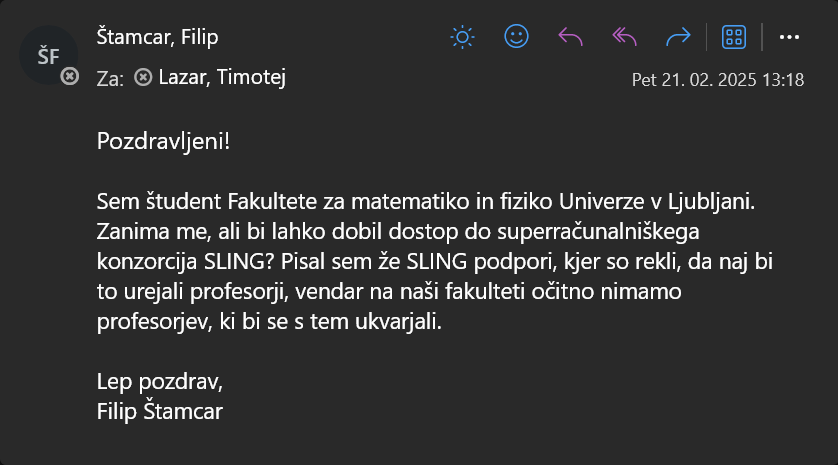

- Odločitev za grafično knjižnjico (doxus)
    - ne tako zelo znana, zato je malo obstoječih primerov
- Iskanje modela za OCR
    - rust model => tesseract
    - zmogljiv model Qwen 2.5 VL, ki ni primeren za poganjanje na zasebnem računalniku, zato ...
    - Superračunalnik od Arnesa prek Slovenskega nacionalnega superračunalniškega omrežja SLING
    - 
- Shranjevanje podatkov 
    - variacije imen
    - [Slovenska historična topografija](https://topografija.zrc-sazu.si/)
    - 
- Vidina vizija drsnikov - se ne da v rustu
    - [grid.js](assets/scripts/grid.js)
- Prvi prevajalniški hrošč
    - [issue](https://github.com/niXman/mingw-builds/issues/706)
    - [report](https://gcc.gnu.org/bugzilla/show_bug.cgi?id=120192)
- Midva lepo mirno delava naprej, js se mirno ukvarjam z vnosnimi polji, a potem ...
    - prevajalnik ne želi več prevajati kode,
    - cargo checker se poganja več kot 10 minut in nato sproducira več kot 2000 vrstično sporočilo o napaki
    - Ko želim zagnati program porabi tudi do 30Gb rama

    - hrošč v Rustc
    - [issue](https://github.com/rust-lang/rust/issues/139142)
    - težava odpravljena v Rust 1.88.0, ki bo izšla 25. 6. 2025
